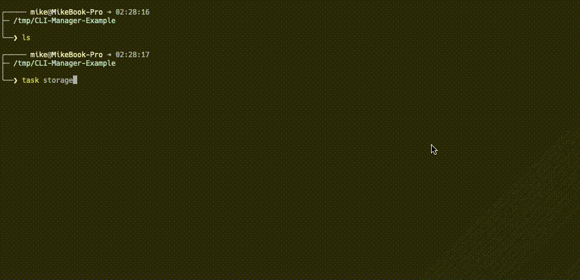

# CLI Task Manager

Providing an easy and usefull Command Line Interface for managing tasks on the fly

Will store inside a local file your tasks in a simple JSON format so you can track their evolution using version control.



---

# Table of content

- [Installation](#installation)
- [Use](#use)
	- [Init](#init)
	- [Files](#files)
		- [The storage file](#the-storage-file)
		- [The config file](#the-config-file)
	- [Printing arguments](#printing-arguments)
	- [Commands](#commands)
- [Intended workflow](#intended-workflow)
- [Changelog](#changelog)

---

# Installation

Requires [NPM](https://docs.npmjs.com/downloading-and-installing-node-js-and-npm)

```sh
npm i -g cli-task-manager # Install package

task --version # Print installed version
task --help # Print the manuel
```

---

# Use

## Init

```sh
task storage	# Will generate a task storage file 'tasks.json' under working directory
task storage ./tasks/v0.1.0.json	# Will generate a task storage file under specified location
task config	# Will generate the optional config file 'task.config.json' to pass default arguments to the CLI
```

### Files

- `tasks.json or the name you want`, a storage file
- `task.config.json`, the configuration file, **optional**

#### The storage file

By default named `tasks.json` in your working directory, he stores your tasks and states

> If your storage file is different than the default `tasks.json`, you either have to pass the _storage_ argument for every CLI commands
> or use the _storageFile_ attribute in the [config file](#the-config-file) see []

_Example:_

```sh
task storage [<relative path>] # Create a task storage file, path optional
```

```json
{
	"meta":
	{
		"states": [
			{
				"name": "todo",
				"hexColor": "#ff8f00",
				"icon": "☐"
			},
			{
				"name": "wip",
				"hexColor": "#ab47bc",
				"icon": "✹"
			},
			{
				"name": "to test",
				"hexColor": "#2196f3",
				"icon": "♦"
			},
			{
				"name": "done",
				"hexColor": "#66bb6a",
				"icon": "✔"
			}
		]
	},
	"datas":
	[
		{
			"name": "Add more stuff",
			"description": "There's a lot of things to do",
			"state": "todo",
			"id": 0,
		}
	]
}
```

_states_:

An `ordered` array of objects that defined task state progression

#### The config file

**Optional** file named `task.config.json` in your working directory, it defines the default argument to pass to the CLI.

_Example:_

```sh
task config # Create a task config file
```

```json
{
	"hideDescription": true,
	"hideTree": true,
	"shouldNotPrintAfter": false,
	"hideCompleted": true,

	"depth" : 3,

	"storageFile": "./tasks/v0.1.0.json",
}
```

Check [printing options](#printing-arguments) for more options

---

## Printing arguments

Can either be passed as CLI arguments or stored in the [config file](#the-config-file)

| CLI arg				| CLI 'bypass' arg		| Config file attribute						| Description								|
| -----					| -----					| -----										| -----										|
| --storage \<path>		| /						| "storageFile": "./path/storageFile.json"	| Which storage file to use, if not default	|
| --depth \<n>			| /						| "depth": n								| Reduce the child subtask level depth		|
| --hide-description	| --show-description	| "hideDescription": true					| Hide tasks descriprion					|
| --hide-completed		| --show-completed		| "hideCompleted": true						| Hide tasks which reached final state		|
| --hide-tree			| /						| "hideTree": true							| Hide tree branches						|
| --no-print			| --print				| "shouldNotPrintAfter": true				| Don't print task list after edition		|
| --group \<attribute>	| /						| "group": "state"							| Group by attribute (state, id, priority)	|
| --sort \<asc\|desc>	| /						| "sort": "desc"							| Sort order								|

> **Priority:** CLI arg > CLI 'bypass' arg > Config file attribute

---

## Commands

You can use the _help_ flag if you want a quick reminder of the CLI commands

```sh
task --help # Full manuel
task a --help # Print help for adding task

# Adding tasks
task a	# Create a new task with interactive prompt
task a 'refactor logs'	# Create a task 'refactor logs'
task a 'better interface' '!!'	# Create 1 task 'better interface' with a priority of 2
task a 'long task' -d 'Some description'	# Create a task with a Description
task a 'a statefull task' -s 'to test'	# Create a task with the State 'to test'
task a 12 'first sub task'	# Add sub-task to the task n° 12

# View specific
task 9	# Print only what's in task n°9
task 9,13	# Print details on what's in task n°9 and 13

# Editing tasks
task e 9	# Edit taks attributes with interactive prompt
task e 9 'renaming the task' -s 'wip'	# Rename task n°9 and change its state
task e 9,7,2 -s 'to test'	# Change state to 'done'
task c 7	# Put task to final state, 'Check'
task i 11,14	# Pass tasks 11 and 14 to next state, "Increment"
task i 11,14 -r	# Pass tasks 11 and 14 and their subtasks to next state, "Increment"

# Moving tasks
task mv 9,7,11 3	# Move multiple tasks and subtasks to task as subtasks (maintining tree structure)

# Deleting tasks
task d 9,7,11	# Delting tasks 9, 7 and 11

# Extracting to new file
task x 9,7,11 newFile.json	# Move tasks 9, 7 and 11 to a new storage file ./newFile.json
```

> CLI commands are ment to help you manage your tasks quicker but you can manually edit them if you want !

# Intended Workflow

Start by a simple `task storage` at the root of your project

Create and manage your tasks and subtasks with CLI or direct file edition

If you feel like you should break down your storage file as it become to crowded, cut out some of the tasks into a new storage file, and change the default storage path in your config file (`task config`)

Keep track of stuff you need to do using a VCS like Git

You may want to create a _tasks_ folder where you could add a new storage file for every release with `task storage ./tasks/v1.json`, with version control, it could act as a changelog for instance

Using `t` as an alias is also simpler

---

# Changelog

Check the `tasks` folder to see what has been done !